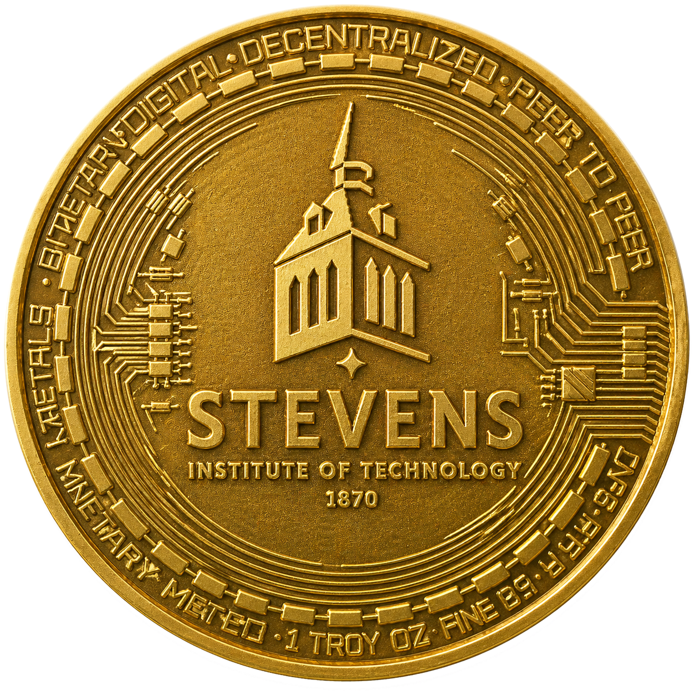

<div align="center">



# DeFi Statistics Center

**An open data workbench for the programmable economy.**

Ask in plain English. Get runnable SQL over **8 DeFi protocols + Ethereum chain state**, surfaced as 12 live schemas in one workbench.

[](https://www.stevens.edu)
[](https://react.dev)
[](https://vitejs.dev)
[](https://www.postgresql.org)

</div>

---

## ✦ Agent Query for the Programmable Economy

> **The main selling point.** Ask the question. Don't write the SQL.

DeFi data is fragmented. Each protocol publishes its own subgraph, its own decoder, its own dashboard. To answer a single research question — *"What block had the most swap activity across the major DEXs?"* — you stitch three subgraphs, normalize three schemas, and write three CTEs.

The **Agent Query** pane collapses that into a sentence:

```
> what is the top most block with most swaps
```

The agent reads the **full live schema** of every protocol, picks the right tables, writes a UNION across them, and hands you a **runnable, syntax-highlighted, editable SQL block** (using the schemas exposed in [`src/lib/schema.ts`](./src/lib/schema.ts)):

```sql
SELECT
  block_number,
  COUNT(*) AS swap_count
FROM (
  SELECT block_number FROM uniswap_v3.swaps
  UNION ALL
  SELECT block_number FROM curve.exchanges
  UNION ALL
  SELECT block_number FROM balancer_v2.swaps
) AS all_swaps
GROUP BY block_number
ORDER BY swap_count DESC
LIMIT 1;
```

Click **Run ▶** — get answers, not boilerplate.

This is what we mean by a *programmable economy*: the on-chain ledger is already a database. We're just giving researchers, students, and traders a query layer that **speaks their language**.

<div align="center">

<sub>▶ <strong><a href="./public/demo-agentic-query.mp4">Watch the agent build this query in real time (MP4 demo, 1 min)</a></strong></sub>

</div>

---

## ✦ What's covered

**12 schemas — 8 DeFi protocols + 4 infrastructure / native datasets — over 30 indexed tables**, served from a Postgres warehouse on the Stevens campus. See [`src/pages/Workbench/schemaGuide.ts`](./src/pages/Workbench/schemaGuide.ts) for the canonical list.

| Category          | Schemas                                                       |
| ----------------- | ------------------------------------------------------------- |
| 💱 Exchanges       | **Uniswap V3** · **Curve** · **Balancer V2**                  |
| 🏦 Lending         | **Aave V2** · **Aave V3** · **Compound V3** · **Morpho** · **Spark** |
| ⚙️  Infrastructure | **Ethereum** (blocks · txs · logs) · **Bridges** · **Tokens** |
| 🏛️ DSC native      | curated cross-protocol views                                  |

> Every table is *event-level* — pool creations, swaps, deposits, borrows, liquidations, bridge transfers — joined back to the canonical Ethereum block stream. That means **provable, replayable, time-travel queries** down to the transaction.

---

## ✦ Three panes, one workbench

<table>
<tr>
<td width="33%" valign="top">

### 🌳 Schema Tree
Browse all 12 protocols by category. Click a table to see column names, types, and human-readable descriptions sourced from the protocol's own docs. No more guessing whether `amount0In` is wei or scaled.

</td>
<td width="33%" valign="top">

### ✏️ Query Builder
Visual SOURCE → SELECT → WHERE → GROUP BY → ORDER BY composer for users who'd rather click than type. Generates the same SQL the Agent does.

</td>
<td width="33%" valign="top">

### 🤖 Agent Query
Plain-English in, runnable SQL out. The agent has the **full schema in context** so it never hallucinates a column. Keeps multi-turn history so you can refine: *"now group by hour"*, *"only WETH pools"*.

</td>
</tr>
</table>

---

## ✦ Why this exists

Most DeFi dashboards are **point solutions** — Dune for trader analytics, DefiLlama for TVL, Etherscan for tx-level lookups. None give you a single SQL endpoint with **decoded protocol logic across protocols** that you can drive from a chat interface.

DSC is the layer we wanted to exist for our own research:

- 📈 **Microstructure research** — does a pool's gas-priority pattern change before a CEX dump?
- 🔬 **Mechanism design** — how does a new fee curve affect realized LVR vs. backtest?
- 🧠 **Alpha discovery** — find on-chain events that systematically precede price moves.

The same workbench that lets a finance student ask *"show me the biggest WETH/USDC swap of the week"* also lets a researcher ask *"join Aave V3 liquidations against Uniswap V3 swap volume in the same block"* — and get the SQL back in seconds.

---

## ✦ Tech stack

```
                     ┌──────────────────────────────────────┐
                     │    Web (Vite 8 + React 19 + TS)      │
                     │  Workbench · Mempool · Landing       │
                     └────────────┬─────────────────────────┘
                                  │  /api/nl    /api/query
                     ┌────────────┴─────────────────────────┐
                     │       Node API ( :3001 )             │
                     │   NL → SQL (Claude / MiniMax)        │
                     │   schema introspection cache         │
                     └────────────┬─────────────────────────┘
                                  │ Postgres protocol
                     ┌────────────┴─────────────────────────┐
                     │  Postgres @ fscresearchvm89          │
                     │  12 schemas · 32 tables · 23 GB      │
                     └────────────┬─────────────────────────┘
                                  │  reth+lighthouse
                     ┌────────────┴─────────────────────────┐
                     │  Ethereum archive node (RETH)        │
                     └──────────────────────────────────────┘
```

| Layer       | Tech                                                                              |
| ----------- | --------------------------------------------------------------------------------- |
| Frontend    | React 19 · TypeScript · Vite 8 · React Router 7 · custom CSS (Stevens design system) |
| API         | Node service (`/api/nl`, `/api/query`, `/api/schema`, `/api/node`)                  |
| Warehouse   | Postgres, 12 schemas of decoded event data                                         |
| Source data | RETH archive node + Lighthouse beacon, decoded via per-protocol pipelines          |

---

## ✦ Quick start

```bash
git clone https://github.com/WillInvest/DeFi-Statistic-Center.git
cd DeFi-Statistic-Center
pnpm install
pnpm dev
# → http://localhost:5173
```

The dev server proxies `/api/*` to a backend at `localhost:3001`. To stand up the warehouse + API yourself, see [`design/HANDOFF-README.md`](./design/HANDOFF-README.md).

```bash
pnpm build       # type-check + production bundle
pnpm preview     # serve the production build locally
pnpm lint        # ESLint pass
```

---

## ✦ Status & roadmap

- [x] Workbench — Schema Tree, Query Builder, Agent Query, Results
- [x] Mempool live tx feed (Stevens campus RETH node)
- [x] 12 schemas indexed
- [ ] Saved queries + share links
- [ ] Notebook export (Polars / Pandas)
- [ ] Cross-chain (L2s, Solana)
- [ ] Public hosted instance

---

## ✦ Built at Stevens

<div align="center">


This project is part of an ongoing program at the
**[Stevens Institute of Technology](https://www.stevens.edu)** Financial Systems Lab
on **on-chain market microstructure and programmable-economy research**.

PRs and issues welcome.

</div>

---

<div align="center">

**Stevens Maroon** `#A32638` · **Charcoal** `#363D45` · **Gold** `#EBC73B`

<sub>© 2026 Stevens Institute of Technology Financial Systems Lab</sub>

</div>
